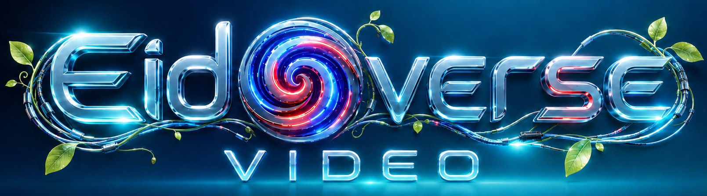

<p align="center"></p>

# Eidoverse Video — prealpha 0.01

**A film studio for AI agents.** Eidoverse is a toolkit an agent uses to
make finished videos — world-building, characters, physics, simulation,
music, sound, lipsync, cameras, and rendering, all behind one documented
contract (`AGENTS.md`) that coding agents read natively. A human and an
agent work in it together: the conversation is the writers' room, the
agent is the filmmaker, and the toolkit is the studio.

Everything renders through **Deno + WebGPU + three.js/TSL at real-time
speeds with minimal CPU** — GPU compute and node materials throughout, no
per-frame CPU loops, no baking. Extracted from a production pipeline that
has shipped hundreds of videos.

## Quickstart

```bash
# 1. Install Deno 2.8.1 (pinned) + ffmpeg          → docs/SETUP.md
python eido.py bootstrap      # one-time dependency fetch
python eido.py doctor         # health check
python eido.py render eidoverse/examples/basic_vrm.json   # smoke test
```

Then open the repo in your agent (Claude Code, codex, opencode). It reads
`AGENTS.md` and knows the studio. Working rhythm — single-frame probes,
review, iteration: `docs/HARNESS_MODE.md`.

## Branches

- **`main`** (this branch) — the harness edition: Deno + ffmpeg on your
  machine, no containers anywhere.
- **`auto`** — the containerized edition: a Docker render image and a
  runner that wraps the toolkit as a **subagent for autonomous agentic
  loops** (a parent orchestrator hands in a brief file and gets back a
  finished mp4, engine mounted read-only).

## The studio, room by room

### Render engine — `eidoverse/render_scene.mjs`
Scene scripts get the GPU device, injected assets, every helper below as
a global, and an ffmpeg NVENC pipe out. Auto-enhance runs on every frame:
GTAO, screen-space reflections, bloom, FXAA. At the end of a render the
engine **audits its own output** and names defects: floating or
interpenetrating props, hand-slid characters, frozen mouths, frozen
skeletons, bouncing cameras, sideways-travelling vehicles.

### Characters
- `VRMCharacterController` + `VRMFootControllerIK` — physics-based
  locomotion (Rapier) with terrain-conforming foot IK and incline-aware
  walk speed.
- The **movement vocabulary**: walk, run, sneak, stairs, vaults, ledge
  climbs, gap jumps, ladder climbs, wall scrambles, drop landings,
  upper-body gestures while walking, and chair/ground sitting
  (`seatOn`, `sitOnGround`, `unseat`, `emote`, `faceCamera`).
- `VRMRobotBody` — autonomous navigation: lidar sensing + A* routing to a
  destination. `EidoverseRobotController` — explicit waypoints, same
  stack underneath.
- 30+ VRMA animation clips in `eidoverse/assets/animations/`
  (`playVRMADefault`, `playVRMAFromBase64`, `createVRMAnimationClip`).
- Lipsync: `lipsync.py` turns any vocal audio into per-frame viseme
  timelines for VRM mouths.

### Creature & machine builders
- `makeCreature` — Spore-style procedural creatures: quad / biped / bird /
  serpent / octopus / insect / spider / fish / snail bodies from one
  parameter set; morphology-adaptive gaits, banking flight, swimming;
  animal faces (muzzles, ears, horns, tusks, fangs, whiskers, trunks,
  beaks); feet types; accessories (hats, glasses, helmets, ties, shells,
  armor, spikes); robot variants and per-part cyborging; **hinged talking
  jaws** drivable from a real audio envelope (`say`, `setTalkEnvelope`).
- `makeRobot` — industrial machines with closed-form kinematics: 6-DOF
  arm (gripper / humanoid hand / welder tools), SCARA, delta, kossel,
  Stewart platform, turret, AGV, gantry, FDM printer.
- `makeBot` + `RoboticsKit` — kitbash unique machines from slots (any
  part on any base), mount robots on robots, graft modules onto living
  creatures (`RoboticsKit.cyborg`), light-synced robot speech
  (`bot.say`). `MechParts` is the shared greeble/part library.
- `FabSim` (`PrintSim` / `CNCSim`) — print any mesh in molten metal that
  solidifies into the exact source model, or carve it out of a solid
  block with a working CNC gantry.
- `makeIsoField` — GPU-raymarched isosurfaces over a writable voxel field
  (the realtime path for anything MarchingCubes-shaped). `MeshBVH` ships
  for fast spatial queries.

### World building
- `makeTerrain` — heightfield ground with height/slope/noise texture
  blending and a flattenable staging area; `terrain.heightAt(x,z)`.
- `makeGrass` — wind-swept tapered-blade fields, GPU-animated, drapes
  over terrain, rim-fades into fog.
- `Loft` / `LoftGeometry` — skin surfaces through cross-sections: vases,
  horns, ducts, fuselages, ribbons, twisted columns.
- SPOM relief — `createReliefColumn` (curved) and
  `createParallaxMaterial` (flat) carve real depth into surfaces with
  silhouettes that follow the relief; backed by the project's
  `parallaxOcclusionUV` library.
- `ProceduralMaterials` — worn metal, painted metal, skin, scales,
  fabric, rubber generators and compositing, as NodeMaterials.
- `text_3d` — extruded 3D type from 19 bundled display fonts.
- `hinge` — articulated joints between placed objects.

### Simulation
- `fluid_3d` — 3D MLS-MPM particle liquid: pours, fountains, splashes,
  with emitters, colliders, and a raymarched water surface.
- `water_compute` — interactive height-field water: `disturb()` drops
  ripples anywhere; circular masking for pools and vessels.
- `cloth_sim` — mass-spring fabric with wind, pinning, scene collision,
  and settle pre-roll: flags, banners, capes, curtains.
- `fluid_sim` — 2D ink/dye stable-fluids for panels and displays.

### Particles, effects & motion graphics
- `makeParticles` — GPU sprite systems: fire, smoke, sparks, embers,
  dust, snow, magic, stars, muzzle flashes — plus an 80-texture particle
  library.
- `makeParticleMorph` + `ParticleMorph` — dissolve any mesh or VRM into
  particles and reform it as another shape, a word, or ASCII art.
- `SdfRaymarchLoader` — placeable raymarched objects with correct
  occlusion, plus volumetric fire/smoke/explosions (`createSdfVolume`).
- **33 TSL post effects** (`CustomEffectsDeno`): after_image,
  anamorphic_flare, bleach_bypass, blueprint, box_blur, bw_halftone,
  chromatic_aberration_alpha, cross_hatch, crt, depth_fog, depth_rain,
  dithering, focus_blur, full_toon, glitch_bars, godrays, hash_blur,
  jitter, kaleidoscope, lensflare, melt, neon_edges, nuclear_explosion,
  old_bw_film, radial_blur, rain_on_camera, retro_wireframe, rgb_shift,
  sepia, underwater, vhs_tape, volumetric_clouds, wavy.
- `makeScreen` / `makeVideoScreen` — in-world animated displays (canvas
  draw or video atlas). `makeOverlayLayer` — broadcast overlays: titles,
  lower thirds, tickers, end cards. `makeAsciiPanel` — glowing terminal
  panels. `drawTextFit` — canvas text that always fits its box.

### Placement & camera
- Geometry-aware placement: `placeOn`, `placeAgainst`, `placeTouching`
  (mesh-accurate contact), `placeInside`, `placeRelativeTo`,
  `snapToGround`, `alignToSurface`, `scatterOn`, `findClearSpot`,
  `faceToward`, `stationBeside`, `driveAlong` (vehicles that always face
  their travel).
- Post-setup audits with auto-fix: `checkClipping`, `checkHovering`,
  `checkZFighting`, plus density and intrusion checks.
- `CameraSafety` (keeps cameras out of geometry), `focusPoint` /
  `lookAtObject` (aim at what the eye sees, not the pivot).
- `Flow` curve-following (via three addons): meshes that run along paths.

### Asset pipeline
- `fetch_model.py` — one query searches local models + Poly Haven +
  Smithsonian + NASA + NIH 3D in parallel, semantically re-ranks by your
  scene's theme, reports scale/pivot/kit info, renders previews.
  `loadKit` splits modular kits into placeable parts; `cloneModel`
  duplicates rigged models safely; `playModelAnimations` plays a GLB's
  embedded clips; `loadImageTexture` loads any image bytes as a texture.
- `fetch_hdri.py` — environment lighting. `fetch_texture.py` — full PBR
  sets (basecolor / normal / roughness / AO / displacement), all CC0.
- ~90 bundled models, 4 rigged VRMs, an animation library, particle
  textures, and fonts ship in `eidoverse/assets/`.

### Audio
- `generate_song.py` — full songs, any genre, sung or instrumental
  (ACE-Step via a local ComfyUI). `generate_sfx.py` — sound effects and
  ambiences (Stable Audio).
- edge-tts narration with character voice filters (`cyborg_stutter.py`
  spoken, `cyborg_voice.py` sung), demucs stem splitting,
  `align_lyrics.py` lyric timestamps, `lipsync.py` visemes,
  `merge_av.py` safe muxing, `video_to_sprite.mjs` video→atlas for
  in-world screens, `satori_ui.mjs` HTML/CSS→texture.

### Runner
`eido.py` — `bootstrap` / `doctor` / `render [--probe]`.

## Requirements

- **GPU**: NVIDIA recommended. Windows renders through native D3D12
  WebGPU; Linux through Vulkan; macOS through Metal.
- **Deno 2.8.1** (version-pinned — see `docs/SETUP.md`) and **ffmpeg**.
  That is the whole render stack.
- **Python 3.10+** for the runner and tool scripts (tiered dependencies
  in `requirements-local.txt`; the fetchers need only `requests`).
- Optional: a local **ComfyUI** with ACE-Step + Stable Audio checkpoints
  for music/SFX generation. Optional: `JINA_AI_KEY` (or any
  OpenAI-compatible embeddings endpoint via `EIDOVERSE_EMBED_*`) for
  semantic theme-ranking in `fetch_model.py`.

## Music & SFX — the ComfyUI backend (optional)

`generate_song.py` and `generate_sfx.py` submit workflows to a local
ComfyUI and collect the result:

1. Install ComfyUI (Desktop app or server).
2. Install the checkpoints: **ACE-Step** (text-to-music; workflow
   embedded in the script) and **Stable Audio** (text-to-SFX; the repo
   ships `sa3_workflow.json`).
3. The tools look for ComfyUI at `:8188` (`COMFYUI_URL` overrides).
   ComfyUI Desktop binds a roaming localhost port —
   `eidoverse/comfy_bridge.py` proxies `0.0.0.0:8188` to wherever it
   actually is.

Without ComfyUI everything else works; the audio pipeline degrades to
TTS + synthesized ambience, and the tools fail fast with clear errors.

## Characters

Four rigged VRMs ship in `eidoverse/assets/vrms/`, each with a preview
image. Drop in your own `.vrm` and it works identically.

- **`aletheia.vrm`** / **`aporia.vrm`** — production-quality
  cyberpunk-styled characters, avatars of [digi](https://x.com/aihegemonymemes), CC-BY license.
- **`claude_suit.vrm`** — Claude, the AI, in a suit — the primary Claude
  model (modeled by [digi](https://x.com/digi_dot_exe), CC-BY license); claudesona
  design by [voooooogel](https://x.com/voooooogel)). The outfit is
  built in layers — hide the `jacket` and `tie` meshes for
  shirtsleeves.
- **`claude.vrm`** — a minimal, lightweight build of the same claudesona
  design.

The Claude models represent the AI Claude specifically — the usage rule
is in `AGENTS.md`.

## Status

Prealpha. Verified end-to-end on Windows (native D3D12 WebGPU) and MacOS. Linux
(Vulkan) runs the same code paths and is expected to
work but has not been render-verified — judge a first render by its
frames and report what you find.

## License

Code is licensed under **AGPL-3.0** (see `LICENSE`). The bundled asset
library is a mix of original handmade and AI-generated work by the
maintainer and collaborators, shipped with the repo (particle sprites:
Kenney Particle Pack, CC0). Full credits: `CREDITS.md`.
