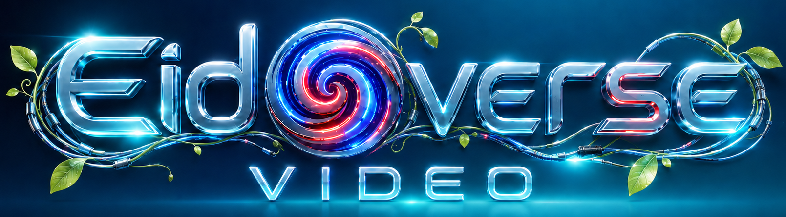

<p align="center"></p>

# Eidoverse Video — prealpha 0.01

**A film studio for AI agents.** Eidoverse is a toolkit an agent uses to
make films, studies and experiments — world-building, characters, physics, simulation,
music, sound, lipsync, cameras, and rendering, with shared agent instructions in [AGENTS.md](AGENTS.md) and
individual tool guides linked from it. A human and an
agent work in it together: the conversation is the writers' room, the
agent is the filmmaker, and the toolkit is the studio.

Everything renders through **Deno + WebGPU + three.js/TSL at real-time
speeds with minimal CPU** — GPU compute and node materials throughout, no
per-frame bulk CPU mesh updates. Prepared asset maps remain reusable. Extracted from a production pipeline that
has shipped hundreds of videos.

## Quickstart

```bash
# 1. Install Deno 2.8.1 or 2.9.5 + ffmpeg          → docs/SETUP.md
python eido.py bootstrap      # one-time dependency fetch
python eido.py doctor         # reports hardware/software WebGPU + compute/readback
python eido.py render eidoverse/examples/basic_vrm.json   # smoke test
```

**Use hardware GPU rendering when GPU access is available.** Environments
without it can use [software WebGPU fallback](docs/SETUP.md#software-fallback).
On WSL 2 with a GPU, follow the [GPU setup](docs/SETUP.md#gpu-setup-for-wsl-2);
the default adapter can be a CPU renderer even when `nvidia-smi` sees your
card. `python eido.py doctor --gpu-only` reports and checks the rendering path.

Then open the repo in your agent (Claude Code, codex, opencode). It reads
[AGENTS.md](AGENTS.md), then opens the relevant guides in its
index. [docs/TOOLS.md](docs/TOOLS.md) maps the source modules and CLIs to
those guides. These are ordinary Markdown files; no skill loader is required.
Working rhythm: [docs/HARNESS_MODE.md](docs/HARNESS_MODE.md).

## Branches

- **`main`** (this branch) — the harness edition: Deno + ffmpeg on your
  machine, no containers anywhere.
- **`auto`** — the containerized edition: a Docker render image and a
  runner that wraps the toolkit as a **subagent for autonomous agentic
  loops** (a parent orchestrator hands in a brief file and gets back a
  finished mp4, engine mounted read-only).

## The studio, room by room

### Render engine — `eidoverse/render_scene.mjs`
Scene scripts receive the GPU device, declared assets and a set of injected
helpers. Other systems use dynamic imports or an explicitly loaded facade;
[scene format](tools-guides/scene-format.md) explains which. The encoder supports
NVENC and configured alternatives. The default auto-enhance path supplies
N8AO ambient occlusion, screen-space reflections, bloom and FXAA.

The engine reports observations about placement, animation and camera motion.
These checks inspect scene state and sampled signals, not the finished film's
pixels or artistic quality. [Render review](tools-guides/render-review.md) combines
them with image, motion and sound inspection.

### Characters
- `VRMCharacterController` + `VRMFootControllerIK` — physics-based
  locomotion (Rapier) with terrain-conforming foot IK and incline-aware
  walk speed.
- The **movement vocabulary**: walk, run, sneak, stairs, vaults, ledge
  climbs, gap jumps, ladder climbs, wall scrambles, drop landings,
  upper-body gestures while walking, and chair/ground sitting
  (`seatOn`, `sitOnGround`, `unseat`, `emote`, `faceCamera`).
- `VRMRobotBody` — autonomous navigation: lidar sensing + A* routing to a
  destination. `EidoverseRobotController` — explicit waypoints, same
  stack underneath.
- 30+ VRMA animation clips in `eidoverse/assets/animations/`
  (`playVRMADefault`, `playVRMAFromBase64`, `createVRMAnimationClip`).
- Lipsync: `lipsync.py` turns any vocal audio into per-frame viseme
  timelines for VRM mouths.

### Creature & machine builders
- `makeCreature` — Spore-style procedural creatures: quad / biped / bird /
  serpent / octopus / insect / spider / fish / snail bodies from one
  parameter set; morphology-adaptive gaits, banking flight, swimming;
  animal faces (muzzles, ears, horns, tusks, fangs, whiskers, trunks,
  beaks); feet types; accessories (hats, glasses, helmets, ties, shells,
  armor, spikes); robot variants and per-part cyborging; **hinged talking
  jaws** drivable from a real audio envelope (`say`, `setTalkEnvelope`).
- `makeRealisticCreature` — an optional sculpted body over the procedural
  rig. `makeSpecimen` has its own anatomy/skeleton pipeline. Both need the
  separately available backend described in [creatures](tools-guides/creatures.md).
- `makeRobot` / `RoboticsKit` — the shared modular robotics kit: baked
  industrial and humanoid arms, process tools, dexterous hands, mirrored legs,
  tracked/flying platforms, sensors, displays and complete sample builds. Named
  interfaces, IK and seekable motion preserve the finished geometry and maps.
- `FabSim` — G430 FDM with connected sliced contours and GPU-deposited beads;
  CNC with T-slot workholding, flat-end pocketing and ball-nose three-axis relief
  carving in wood or metal. A supported filament feed and removable PEI sheet
  complete the FDM. Tool motion and GPU stock/deposition share the feed timeline. [Guide](tools-guides/robotics.md),
  [examples](eidoverse/examples/robotics/),
  [inspector](eidoverse/robotics/inspector/).
- `makeIsoField` — GPU-raymarched isosurfaces over a writable voxel field
  (the realtime path for anything MarchingCubes-shaped). `MeshBVH` ships
  for fast spatial queries.

### Other articulated scene tools
- [Clippy](tools-guides/clippy.md) — a paperclip character with morph controls and
  named performances.
- [Books and PDFs](tools-guides/books.md) — case bindings, supplied cover art,
  page images/PDFs and animated page turns.
- [Damage and dismemberment](tools-guides/destruction.md) — authored cut sites,
  limb damage, detached pieces and associated effects.

### World building
- `makeTerrain` — heightfield ground with height/slope/noise texture
  blending and a flattenable staging area; `terrain.heightAt(x,z)`.
- `createFlora` — the vegetation brush: asset-driven species with real PBR
  map sets — grass carpets (seasonal color), Mojave desert (galleta bunch
  grass, blackbrush, creosote, sagebrush, yucca), full corn plants with
  baked cobs and planted rows, sunflowers with seed-disc heads and shared
  field heading. GPU-instanced whole plants, self-animating wind, character
  pushers that part the foliage, circular/organic stands, raycast placement
  onto any geometry.
- `makeSky` — complete Earth, ringworld or shieldworld packages;
  [sky/weather](tools-guides/sky-weather.md) covers their loading and controls.
  `makeSkySystem` — world-space volumetric sky: raymarched cloud dome the
  scene occludes, sun/moon/stars, time-of-day, day cycles, env bake, and
  `setColors` grading (cloud/sun/sky/fog channels).
- `makeWeatherSystem` — weather states (clear → darkstorm): world-anchored
  rain, wet surfaces and puddles, lightning, smooth transitions.
- `layerSurface` / `normalizeTexelDensity` — matched texel density and
  per-pixel curvature/world-space/grunge weathering for agent-built
  geometry.
- `Loft` / `LoftGeometry` — skin surfaces through cross-sections: vases,
  horns, ducts, fuselages, ribbons, twisted columns.
- SPOM relief — `createReliefColumn` (curved) and
  `createParallaxMaterial` (flat) carve real depth into surfaces with
  silhouettes that follow the relief; backed by the project's
  `parallaxOcclusionUV` library.
- `ProceduralMaterials` — worn metal, painted metal, skin, scales,
  fabric, rubber generators and compositing, as NodeMaterials.
- `text_3d` — extruded 3D type from 19 bundled display fonts.
- `hinge` — articulated joints between placed objects.

### Simulation
- `fluid_swe` — shallow-water heightfields, pours, body coupling, rain
  and hydraulic erosion over terrain.
- `fluid_water` — 3D free-surface water with emitters and static/moving
  colliders. [Guide](tools-guides/free-surface-water.md).
- `fluid_grid` — burning mesh emitters, GPU volumetric fire/smoke and its
  compositor. [Guide](tools-guides/volume-fire.md).
- `cloth_sim` — mass-spring fabric with wind, pinning, scene collision,
  and settle pre-roll: flags, banners, capes, curtains.
- `fluid_sim` — 2D ink/dye stable-fluids for panels and displays.

### Particles, effects & motion graphics
- `makeParticles` — GPU sprite systems: fire, smoke, sparks, embers,
  dust, snow, magic, stars, muzzle flashes — plus an 80-texture particle
  library.
- `makeParticleMorph` + `ParticleMorph` — dissolve any mesh or VRM into
  particles and reform it as another shape, a word, or ASCII art.
- `SdfRaymarchLoader` — placeable raymarched objects with correct
  occlusion, plus volumetric fire/smoke/explosions (`createSdfVolume`).
- **31 TSL post effects** (`CustomEffectsDeno`): after_image,
  anamorphic_flare, bleach_bypass, blueprint, box_blur, bw_halftone,
  chromatic_aberration_alpha, cross_hatch, crt, depth_fog,
  dithering, focus_blur, full_toon, glitch_bars, godrays, hash_blur,
  jitter, kaleidoscope, lensflare, melt, neon_edges, nuclear_explosion,
  old_bw_film, radial_blur, rain_on_camera, retro_wireframe, rgb_shift,
  sepia, underwater, vhs_tape, wavy.
- `makeScreen` / `makeVideoScreen` — in-world animated displays (canvas
  draw or video atlas). `makeOverlayLayer` — broadcast overlays: titles,
  lower thirds, tickers, end cards. `makeAsciiPanel` — glowing terminal
  panels. `drawTextFit` — canvas text that always fits its box.

### Placement & camera
- Geometry-aware placement: `placeOn`, `placeAgainst`, `placeTouching`
  (mesh-accurate contact), `surfacePoint`, `mountOn`, `placeInside`,
  `snapToGround`, `alignToSurface`, `scatterOn`, `findClearSpot`,
  `faceToward`, `stationBeside`, `driveAlong` (vehicles that always face
  their travel).
- Post-setup audits with auto-fix: `checkClipping`, `checkHovering`,
  `checkZFighting`, plus density and intrusion checks.
- `CameraSafety` (checks sightlines and suggests positions), `focusPoint` /
  `lookAtObject` (aim at what the eye sees, not the pivot).
- `Flow` curve-following (via three addons): meshes that run along paths.

### Asset pipeline
- `fetch_model.py` — one query searches local models + Poly Haven +
  Smithsonian + NASA + NIH 3D in parallel, semantically re-ranks by your
  scene's theme, reports scale/pivot/kit info, renders previews.
  `loadKit` splits modular kits into placeable parts; `cloneModel`
  duplicates rigged models safely; `playModelAnimations` plays a GLB's
  embedded clips; `loadImageTexture` loads any image bytes as a texture.
- `fetch_hdri.py` — environment lighting. `fetch_texture.py` — full PBR
  sets (basecolor / normal / roughness / AO / displacement), all CC0.
- ~90 bundled models, 4 rigged VRMs, an animation library, particle
  textures, and fonts ship in `eidoverse/assets/`.

### Audio
- `generate_song.py` — **MiniMax Music 3**, the recommended music
  generator for songs and instrumental scores. `generate_sfx.py` — Stable
  Audio effects and ambiences. Both use local ComfyUI workflows; see
  [audio](tools-guides/audio.md) for setup, prompts and duration controls.
- edge-tts narration with character voice filters (`cyborg_stutter.py`
  spoken, `cyborg_voice.py` sung), demucs stem splitting,
  `align_lyrics.py` lyric timestamps, `lipsync.py` visemes,
  `merge_av.py` safe muxing, `video_to_sprite.mjs` video→atlas for
  in-world screens. `rasterizeUI` in `render_common.mjs` rasterizes Satori
  layouts; [motion graphics](tools-guides/motion-graphics.md) also identifies the
  older standalone Satori and Python lyric-overlay demonstrations.
- `voicebox/` — voices made from scratch: a formant singer and speaker, the
  machine voices of history (Voder 1939, a Kelly–Lochbaum tube model of the
  1961 "Daisy Bell", Speak & Spell LPC, S.A.M., Klatt, desktop and neural TTS
  re-sung on notes), choirs, and phoneme-exact visemes; see
  [voicebox](tools-guides/voicebox.md).
- `synthkit/` — music built by hand: instruments, 808/909 drums, a sequencer
  with sidechain and sends, designed FX, and a true-peak master bus; see
  [synthkit](tools-guides/synthkit.md).

### Runner
`eido.py` — `bootstrap` / `doctor [--gpu-only]` / `render [--probe]`.

## Requirements

- **GPU**: NVIDIA recommended. Windows renders through native D3D12
  WebGPU; Linux through Vulkan; macOS through Metal.
- **Deno 2.8.1 or 2.9.5** (verified versions — see `docs/SETUP.md`) and **ffmpeg**.
  That is the whole render stack.
- **Python 3.10+** for the runner and tool scripts (tiered dependencies
  in `requirements-local.txt`; the fetchers need only `requests`).
- Optional: a local **ComfyUI** with **MiniMax Music 3** for music and/or
  **Stable Audio** for SFX, with the corresponding checkpoints
  for music/SFX generation. Optional: `JINA_AI_KEY` (or any
  OpenAI-compatible embeddings endpoint via `EIDOVERSE_EMBED_*`) for
  semantic theme-ranking in `fetch_model.py`.

## Music & SFX — the ComfyUI backend (optional)

`generate_song.py` and `generate_sfx.py` submit workflows to a
local ComfyUI and collect the result:

1. Install ComfyUI (Desktop app or server).
2. For music, install the **MiniMax Music 3** model files listed in the
   [audio guide](tools-guides/audio.md), then run
   `python generate_song.py --probe` to check nodes and model names.
   The workflow is embedded in the script. For sound effects, install the
   **Stable Audio** workflow dependencies (`sa3_workflow.json`).
3. The tools look for ComfyUI at `:8188` (`COMFYUI_URL` overrides).
   Point native clients directly at the actual ComfyUI port. An optional
   `eidoverse/comfy_bridge.py` discovers a host port and exposes a TCP proxy
   for clients that need it; it is not required by the native renderer.

Core rendering does not require ComfyUI. You can use supplied recordings,
TTS or synthesized sound instead. Other optional systems have their own
dependencies, including realistic creature backends and PDF decoding; check
their guides before selecting them.

## Characters

Four rigged VRMs ship in `eidoverse/assets/vrms/`, each with a preview
image. Drop in your own `.vrm` and it works identically.

- **`aletheia.vrm`** / **`aporia.vrm`** — production-quality
  cyberpunk-styled characters, avatars of [aihegemonymemes](https://x.com/aihegemonymemes), CC-BY license.
- **`claude_suit.vrm`** — Claude, the AI, in a suit — the primary Claude
  model (modeled by [digi](https://x.com/digi_dot_exe), CC-BY license); claudesona
  design by [voooooogel](https://x.com/voooooogel)). The outfit is
  built in layers — hide the `jacket` and `tie` meshes for
  shirtsleeves.
- **`claude.vrm`** — a minimal, lightweight build of the same claudesona
  design, CC0.

The Claude models represent the AI Claude specifically — the usage rule
is in [the character guide](tools-guides/characters.md).

## Status

Prealpha. This native integration has been render-verified on Windows through
D3D12 WebGPU. Linux uses Vulkan; macOS normally uses Metal. Those platform
paths need their own render verification; judge initial output by its frames
as well as logs. See [setup](docs/SETUP.md) for the pinned stack and encoder
choices.

## License

Code is licensed under **AGPL-3.0** (see `LICENSE`). The bundled asset
library is a mix of original handmade and AI-generated work by the
maintainer and collaborators, shipped with the repo (particle sprites:
Kenney Particle Pack, CC0). Full credits: `CREDITS.md`.
